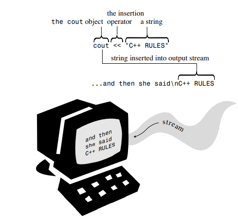

# Lecture0 课程介绍

## 1. 任课老师

* 何明昕：program07 @ yeah.net
* 赵耀：zhaoy6@sustech.edu.cn
* 邮件主题：CS209A + 学号 + 名字：主题

## 2. 课程内容

本课程旨在加深对计算机应用系统设计中的编程和新主题的理解，特别是数据处理、GUI实现、流处理、程序评估、正则表达式的应用和其他对理工科学生有用的高级编程主题和技能

### 期望结果

* 了解软件应用程序设计的设计原则和良好实践
* 应用面向对象编程的编程概念
* 使用 Java 有效地解决现实世界中的问题

### 学习内容

* 设计原则和良好的软件设计
* 编程概念和面向对象编程&#x20;
* 使用 Java 高效地解决现实世界中的问题&#x20;
* 与入门编程课程相比，我们将涵盖在大规模问题解决中有用的方法和模式
* 本文假设了 CS102A 和 CS102B 的一些背景知识

## 3. 课本

**Computer Science: An Interdisciplinary**（Robert Sedgewick & Kevin Wayne）

* [http://introcs.cs.princeton.edu/java/](http://introcs.cs.princeton.edu/java/)

**Introduction to Programming Using Java, Eighth Edition**（David J. Eck）

* [https://math.hws.edu/eck/cs124/javanotes8/](https://math.hws.edu/eck/cs124/javanotes8/)

参考书

* Cay Horstmann. **Java Concepts**, Late Objects, 3e, Wiley 2018
* Robert C. Martin.** Clean Code: A Handbook of Agile Software Craftsmanship**. Prentice Hall, Pearson, 2009
* John Ousterhout.** A Philosophy of Software Design**. Yaknyam Press, 2018

## 4. 打分标准

* Lab 作业 & Project ：50%
* 期末考试：30%（开卷考试）
* Quiz & 练习：20%
  * 可能是 4 次 quiz

### 注意

* 大多数想法将在课堂上讨论，但**有些细节可能会略过**。这些细节在必读材料中有涉及
* 作业和专题应单独完成，但也**允许小组讨论**
* 任何不诚实的行为和作业中的作弊行为都将受到严厉的处理
* 果你从**别人或网上**得到了一个解决方案的想法，你必须在提交时**注明来源**
* 不把你的代码分享给朋友
