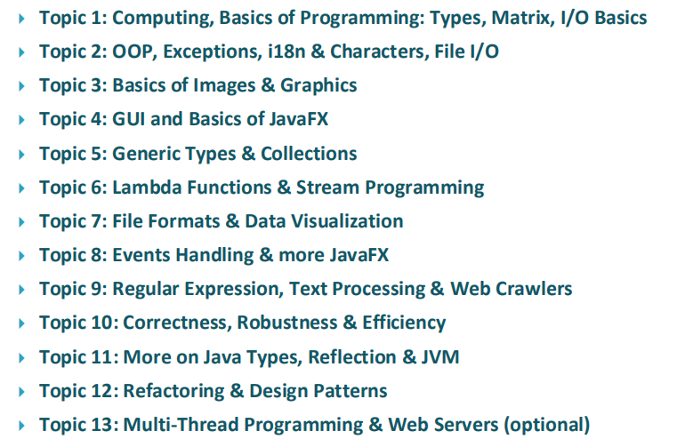

# 1. 进入C++

## 1.1 HelloWorld.cpp

```cpp
// myfirst.cpp -- displays a message
#include <iostream>                           // a PREPROCESSOR directive
int main()                                    // function header
{                                             // start of function body
    using namespace std;                          // make definitions visible
    cout << "Come up and C++ me some time.";      // message
    cout << endl;                                 // start a new line
    cout << "You won’t regret it!" << endl;       // more output
    cin.get();                                    // make the console not closed
    return 0;                                     // terminate main()
}   
```

* C++ 对大小写敏感
* 文件扩展名 .cpp 是一种表示 C++ 的常用方式
* cout 生成字符串输出
* 每条语句以分号结束

### 执行结果

```aspnet
Come up and C++ me some time.
You won't regret it!

Process returned 0(0x0) execution time : 0.001 s
Press ENTER to continue.
```

### 程序调整

**有些 IDE 在运行完后会自动关闭窗口**，可以在 return 前加入如下语句

```cpp
cin.get();
```

来让窗口一直打开，直到按任意键

### 包含元素

HelloWorld.cpp 包含如下元素

* 注释：由前缀 // 标识
* 预处理器编译指令：\#include
* 函数头：int main\(\)
* 编译指令：using namespace
* 函数体：用 { 和 } 括起
* 输出：使用 C++ 的 cout 工具在控制台输出
* 结束：main\(\) 函数的 return 语句

## 1.2 main\(\) 函数

main\(\) 函数的基本结构如下

```cpp
int main()        // function header
{
    // function body
    statements    
    return 0;    // terminates function
}
```

* 函数头：int main\(\)
* 返回语句：return 0;

### main\(\) 函数头的其它写法

```cpp
int main()     // 常规写法
main()         // C 语言写法
int main(void) // 非常显式的写法
void main()    // 省略返回语句的写法（不推荐）
```

### 必须使用 main\(\)

通常，C++ 程序必须包含一个名为 main\(\) 的函数，通常从 main\(\) 函数开始执行

常规程序都需要 mian\(\)

存在例外的情况

* 在 Windows 编程中，可以编写一个**动态链接库 DLL 模块**，这是其她 Windows 可以使用的代码，DLL 不是独立的程序，所以不需要 main\(\)
* **用于专用环境的程序**——如机器人中的控制芯片，可能不需要 main\(\)
* **框架程序**可能调用非标准函数，如 \_tmain\(\)

## 1.3 注释

C++ 提供的注释为

```cpp
// 这是一条注释

/*
    这是一块注释
*/
```

## 1.4 预处理器和 iostream 文件

预处理器在**进行主编译之前**对文件进行处理

```cpp
#include <iostream>
```

该编译指令导致预处理器将 iostream 文件的内容添加到程序中

* 将 iostream 添加进来的原因是为了与外部世界进行通信
* \#include 编译指令将导致 iostream 文件的内容随源代码文件内容一起被发送给编译器
* **使用 cin 和 cout 进行输入和输出的程序必须包含 iostream**

### 头文件名

像 iostream 这样的文件被叫做**包含文件 include file**，由于它们被包含在其它文件中，也叫**头文件 header file**

C++ 编译器自带了很多头文件

## 1.5 名称空间

名称空间是一个 C++ 特性，旨在编写大型程序以及将多个厂商的现有代码结合起来的程序更容易，它有助于组织程序

例如，Microflop 和 Piscine 公司的产品都包含 wanda\(\) 函数，直接调用 wonda\(\) 函数，编译器不知道使用的是哪个版本，名称空间让厂商可以将其产品封装在一个叫做名称空间的单元里

```cpp
Microflop::wanda("Hi!");   // 使用 Microflop 的名称空间
Piscine::wanda("Hi!");     // 使用 Piscine 的名称空间
```

在 HelloWorld.cpp 中，观察到使用了名称空间

```cpp
using namespace std;
```

类、函数和变量都是 C++ 编译器的标准组件，现在它们被放置在了名称空间 std 中

这意味着在 iostream 中定义的用于输出的 cout 实际上是 **std::cout**，endl 其实是 **std:endl**

如果省略编译指令 using，则必须使用下面的方式

```cpp
std::cout << "Come up and C++ me some time.";
std::cout << endl;
```

### 更好的情况

事实上

```cpp
using namespace std;
```

并不是一个很好的选择，更好的方法是，**只使所需的名称可用**

```cpp
using std::cout; // make cout available
using std::endl; // make endl available
using std::cin; // make cin available
```

## 1.6 输入和输出

```cpp
cout << "Come up and C++ me some time.";
```

* 双引号括起的部分是要打印的语句
* &lt;&lt;：表示该语句把这个字符串发送给了 cout，该符号指出了信息流动的路径




### 换行符

* endl：表示重启一行，在输入流中插入 endl 将导致屏幕光标移到下一行的开头
* \n：旧式的换行符

